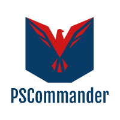

# PSCommander



PSCommander allows you to configure various Windows integration points and execute PowerShell script blocks when certain things happen on your desktop. 



## Features

* CRON Schedules 
* Desktop Shortcuts
* Events
* Explorer Context Menu 
* File Associations 
* Global Hot Keys 
* Tray Icon and Menu

## Installation 

PSCommander is installed as a PowerShell module. You can install it from the PowerShell Gallery. 

```text
Install-Module PSCommander
```

Once you have the module installed, you can cause PSCommander to run at logon by using the `Install-Commander` cmdlet.

```text
Install-Commander
```

## Licensing 

PSCommander requires a PowerShell Pro Tools license. If you already have a license installed, you will be able to use PSCommander. You can also use the `Install-CommanderLicense` cmdlet to install your license file. 

```text
Install-CommanderLicense -Path .\license.txt
```

## Configuration

PSCommander is configured using a single PS1 file. This file is stored within your documents folder. To create a new config file, you can use the following command. 

```text
$Documents = [Environment]::GetFolderPath('MyDocuments')
$Commander = Join-Path $Documents 'PSCommander'
New-Item $Commander -ItemType Directory 
New-Item (Join-Path $Commander 'config.ps1')
```

PSCommander will use this configuration file to load settings. Any changes to the file will result in PSCommander reconfiguring itself. If you don't have PSCommander running yet, you can use `Start-Commander`.

```text
Start-Commander 
```

The following sections outline the commands you can use within the `config.ps1` file. These cmdlets will not work outside of PSCommander. 

## Features 

### CRON Schedules 

PSCommander allows you to run script blocks based on CRON schedules. Note that PSCommander uses a single runspace. Long running scripts are not recommended for use with PSCommander. 

To create a CRON schedule, use `New-CommanderSchedule` within the `config.ps1`file. For example, this configuration will create a schedule that opens notepad every minute. 

You can use a site like [crontab guru](https://crontab.guru/) to define schedules.

```text
New-CommanderSchedule -CronExpression "* * * * *" -Action {
     Start-Process Notepad
}
```

### Desktop Shortcuts

PSCommander can create desktop shortcuts that will execute PowerShell when clicked. Desktop shortcuts require the PSCommander is running so you may want to use `Install-Commander` to ensure that it has been started before a user clicks a shortcut. 

You can configure the text, description and icon for the shortcut. This example creates a desktop shortcut that opens notepad when clicked. 

```text
New-CommanderShortcut -Text 'Click Me' -Description 'Nice' -Action {
    Start-Process notepad
}
```

### Events


This documentation is for a future version of PSCommander.


PSCommander can register event handlers that invoke script blocks based on events happening within your system. You can use the `Register-CommanderEvent` cmdlet to listen to these events.

The following example starts notepad when commander starts.

```text
Register-CommanderEvent -OnCommander Start -Action {
   Start-Process notepad
}
```

You can also listen to events that are happening with Windows using WMI event filters. This example will use the built-in `ProcessStarted` event to run a script block whenever a process is started. This example writes to a file. The `$args[0]` is the WMI object that was created. 

```text
Register-CommanderEvent -OnWindows ProcessStarted -Action {
   $Args[0]['Name'] | Out-File C:\users\adamr\desktop\process-name.txt
}
```

### Explorer Context Menus 

PSCommander can create context menu items that appear when right clicking on folders and files within Windows Explorer. Your script block will receive the path to the folder or file via the `$Args[0]` variable. 

You can create context menu items that appear on folders or only apply to particular extensions of files. 

This example creates a context menu that displays as Click Me and opens VS Code to the file that was clicked.

```text
New-CommanderContextMenu -Text 'Click me' -Action {
    Start-Process code -ArgumentList $args[0]
}
```

### File Associations

PSCommander allows you to associate files with script blocks defined within the commander configuration. You can define the extension and action to take when the file type is open. You will receive the full file path in the `$Args[0]` variable. 

This example opens VS Code based on the file that was opened and associates it with the `.ps2` file extension. 

```text
New-CommanderFileAssociation -Extension ".ps2" -Action {
    Start-Process code -ArgumentList $Args[0]
}
```

### Global Hot Keys

PSCommander allows you to associate global hot keys to PowerShell actions. 

This example defines a hot key that is invoked whenever the `Ctrl+T` key combo is pressed. Note that key combinations cannot interfere with other pre-existing combinations. 

```text
New-CommanderHotKey -Key 'T' -ModifierKey 'Ctrl' -Action { 
    Start-Process notepad
}
```

### Tray Icon and Menu

PSCommander provides configuration for the tray icon. You can define the hover text and the icon that is displayed. You can choose to hide the Exit and Edit Config options and define your own right click menus. 

Tray menu items can invoke script actions and you can define menu items dynamically. This example creates some menu items statically and dynamically.

```text
New-CommanderToolbarIcon -MenuItem @(
    New-CommanderMenuItem -Text 'Notepad' -Action {
        Start-Process notepad
    } -MenuItem @(
        New-CommanderMenuItem -Text 'Subnotepad' -Action {
            Start-Process notepad
        }
    ) -LoadMenuItems {  
        New-CommanderMenuItem -Text 'Dynamic SubNotepad' -Action {
            Start-Process notepad
        }
    }
) -LoadMenuItems {
    New-CommanderMenuItem -Text 'Dynmaic Notepad' -Action {
        Start-Process notepad
    }
}
```

