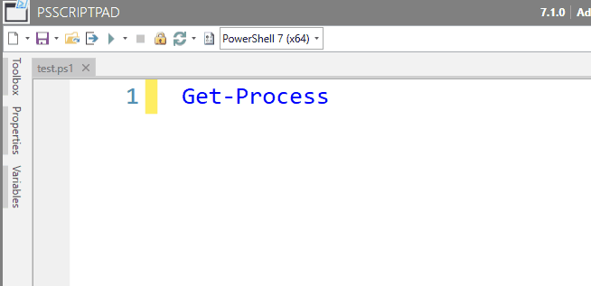
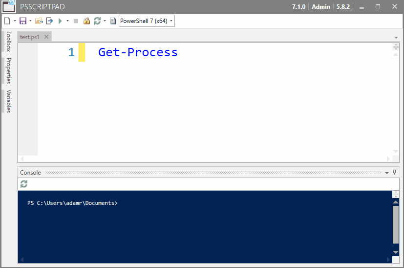
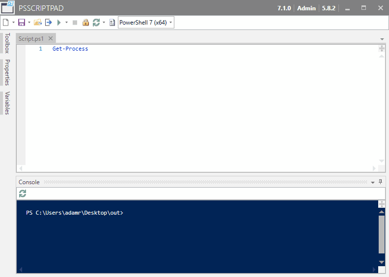
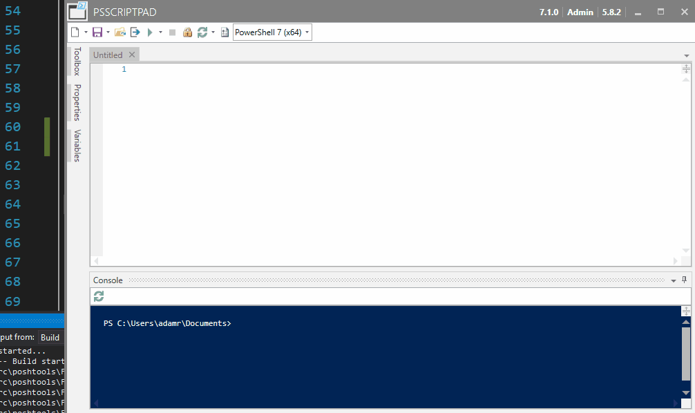
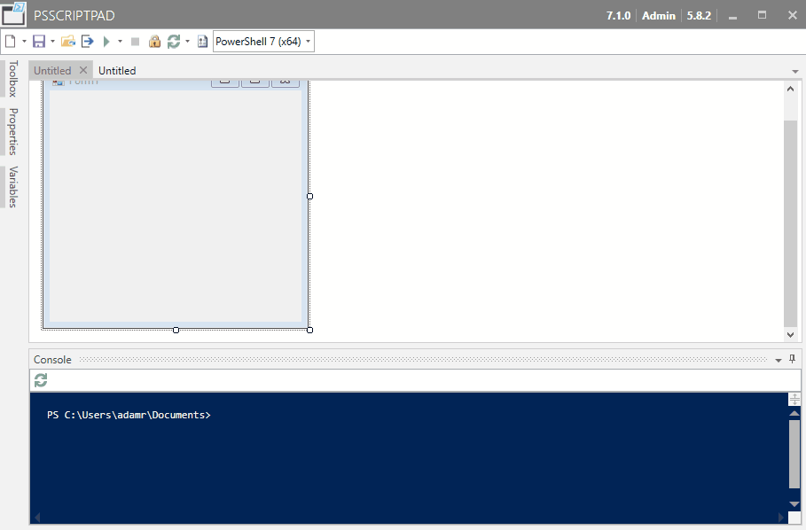
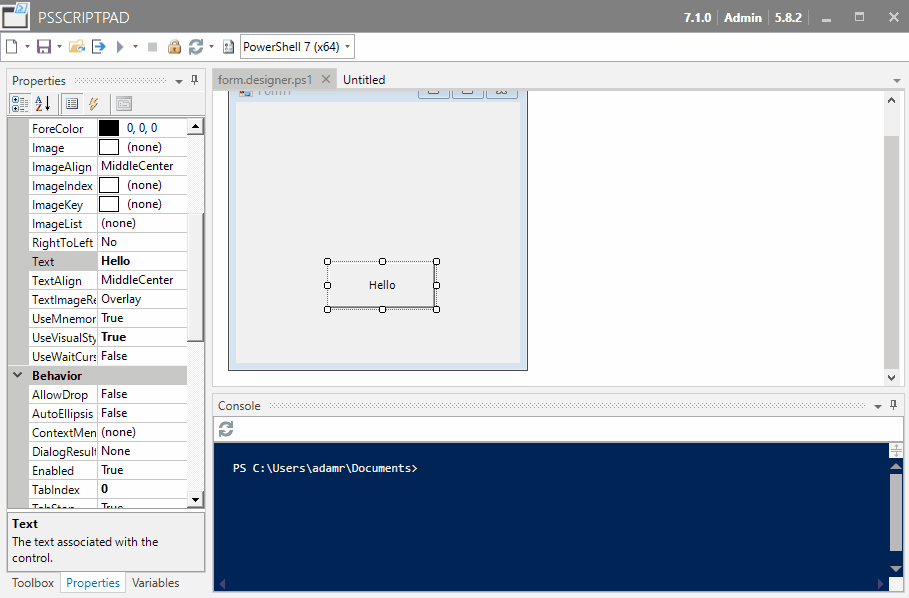
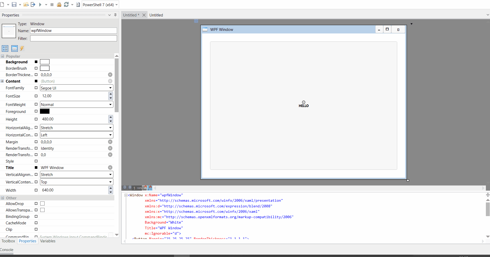

# PSScriptPad

PSScriptPad is the tiny editor for Windows PowerShell and PowerShell 7. It requires no installation or configuration. It weighs in around 4Mbs, can edit, execute and debug PowerShell scripts, design Windows Forms, WPF Windows, and Package Executables.&#x20;

## Download

You can [download PSScriptPad from our website](https://ironmansoftware.com/downloads). It is just a .exe file.&#x20;

## PowerShell Versions

PSScriptPad allows you to select the PowerShell version. The dropdown on the top of the window can be used to select the PS version.&#x20;

.png>)

### Integrated Version

The integrated version uses the PowerShell host within PSScriptPad rather than starting an external PowerShell process.&#x20;

## Editing PowerShell

PSScriptPad supports editing PowerShell scripts. It supports syntax highlighting, syntax checking, IntelliSense and code folding.&#x20;

#### Creating a New PowerShell File

Click the New File button on the toolbar to create a new file.&#x20;

.png>)

#### Opening a PowerShell Script

Click the Open File button on the toolbar to open a script.&#x20;

 (1).png>)

#### IntelliSense&#x20;

IntelliSense is automatically invoked. It will complete PowerShell cmdlet names, variables, paths, and parameter names. You can also press `Ctrl+Space` to manually invoke IntelliSense. As you type, the IntelliSense list will be filtered. Pressing tab will select and insert the current option.&#x20;

 (1).png>)

#### Code Folding&#x20;

Code Folding collapses blocks of PowerShell script that you wish to hide. You can collapse blocks such as if blocks, script blocks and functions blocks. Just click the minus and plus sign to close and open blocks.&#x20;


### PSScriptAnalyzer Support

PSScriptPad will show PSScriptAnalyzer warnings if it is installed. You can customize your PSScriptAnalyzer settings by placing a configuration file in `$Env:AppData\PowerShell Pro Tools\PSScriptAnalyzerSettings.psd1`.

.png>)

## Debugging&#x20;

PSScriptPad can also debug PowerShell scripts. It supports executing scripts, setting breakpoints, stepping through scripts and viewing the output of scripts in the terminal window.&#x20;

### Setting a breakpoint&#x20;

You can set breakpoints by clicking in the editor margin or by using the `F9` button to toggle a breakpoint on the selected line.&#x20;



### Running a Script

You can run a script by clicking the Run button or by pressing `F5`. It will run the currently open tab.&#x20;



### Stepping through a script

You can single step through a script using the following keys:

* `F10` - Step over
* `F11` - Step Into
* `Shift+F11` - Step Out


## Packaging Scripts

PSScriptPad can package scripts to executables using [package.psd1](packaging/package.psd1.md) files or by selecting a PS1 file and packaging with the default settings.&#x20;

### Packaging Without a Package.PSD1 file

You can select an PS1 file and click the package button and the script will be packaged into an executable. Results of the packaging process will be shown within the Console.&#x20;


### Packaging with a Package.PSD1 File

[Package.psd1](packaging/package.psd1.md) files allow you to configure all the settings for the packaging process. You can create a package.psd1 file and then when you click the Package button, it will use that file for configuration.




## Windows Form Designer

The Windows Form Designer allows you to create forms with PowerShell scripts.&#x20;

### Creating a new Form

You can create a new form by click the drop arrow next to the new file button and click New Windows Form.



### Adding Controls to a Form

You can add controls to a form by expanding the toolbox pane, clicking the control you'd like to add and then clicking on the form.



### Setting Properties of Controls

You can set the properties of a control by selecting the control and then modifying properties in the Properties pane.&#x20;


### Setting Event Handlers

You can set event handlers for a control by selecting the control, clicking the lightening bolt icon in the Properties pane and then typing the name of the event handler for the event you'd like to hook up. After saving the form, you can view the code-behind file to define what happens when the event takes place.&#x20;



### Running a Form

You can run a form by open the PS1 file for your form and pressing `F5` or by clicking the run button.&#x20;


## Scratch Pad

The Scratch Pad is a way of quickly testing scripts. Open the Script Pad by clicking the Open Scratch Pad button on the toolbar. The Scratch Pad will save automatically and you can execute scripts immediately.&#x20;

Scratches are saved and visible in the Scratches window. Scratches contain the scratch that was executed and the output that was generated from the scratch.&#x20;

.png>)

## WPF Designer

The WPF designer allows you to visually create WPF forms. You can use the inline editor to adjust properties of the form and see it update in real time. You can then use the XAML in your PowerShell scripts.

### Create a WPF Form

Click the New WPF Form button to create a new WPF form. It will open the WPF designer.


### Editing the Form

You can use the inline XAML editor to adjust properties of controls and add new ones. For example, you can add a button to your form by including the following XAML.

```
<Button>Click Me</Button>
```

### Setting Control Properties

You can use the Property window to set properties of a control. To do so, select the control you'd like to modify and then set the specified property in the Property window. The designer and XAML will update after you press `Enter` .&#x20;



### Integrating with PowerShell

Depending on the PowerShell host, you may need to load the WPF framework.

```
[System.Reflection.Assembly]::LoadWithPartialName("PresentationFramework") | Out-Null
```

XAML can be loaded directly with PowerShell using WPF classes. To load a WPF form from XAML, you can use the `Import-Xaml` function below.

```
function Import-Xaml {
	[xml]$xaml = Get-Content -Path $PSScriptRoot\WpfWindow.xaml
	$manager = New-Object System.Xml.XmlNamespaceManager -ArgumentList $xaml.NameTable
	$manager.AddNamespace("x", "http://schemas.microsoft.com/winfx/2006/xaml");
	$xamlReader = New-Object System.Xml.XmlNodeReader $xaml
	[Windows.Markup.XamlReader]::Load($xamlReader)
}
```

To show the form, you can load the XAML, store the result in a  variable and then call `ShowDialog`.

```
$Window = Import-Xaml
$Window.ShowDialog()
```

You can configure event handlers by selecting the controls and then add script blocks to the events. You will need to ensure that you have names provided for your controls. For example, the XAML below defines a button with the name `Button`.

```
<?xml version="1.0" encoding="utf-16"?>
<Window xmlns="http://schemas.microsoft.com/winfx/2006/xaml/presentation" xmlns:x="http://schemas.microsoft.com/winfx/2006/xaml" xmlns:d="http://schemas.microsoft.com/expression/blend/2008" xmlns:mc="http://schemas.openxmlformats.org/markup-compatibility/2006" mc:Ignorable="d" x:Name="wpfWindow" Background="White" Title="WPF Window">
   <Button x:Name="Button">Click</Button>
</Window>
```

To select the button in PowerShell, you can use the Window's `FindName` method.

```
$Button = $Window.FindName('Button')
```

To set an event handler, like a button click, you can then use `add_Click` on the button.

```
$Button.add_Click({
   # Script Here
})
```

## Options

### Context Menu

Add an Open with PSScriptPad context menu item to Windows Explorer so you can right click on PS1 files and open them in the editor.

### Font Size

Set the font size for the terminal and code editor windows.

### Override Execution Policy

Set the execution policy for PSScriptPad to Bypass.

### Themes

You can switch between dark and light themes using the options dialog.&#x20;

.png>)

## Keyboard Shortcuts

| Keyboard Shortcuts | Action                      | Used In                |
| ------------------ | --------------------------- | ---------------------- |
| Ctrl+S             | Save                        | Script, Form Designers |
| F5                 | Start Debugging or Continue | Script                 |
| F8                 | Execute Selection           | Script                 |
| F9                 | Toggle Breakpoint           | Script                 |
| F10                | Step Over                   | Script                 |
| F11                | Step Into                   | Script                 |
| Shift+F11          | Step Out                    | Script                 |
| Ctrl+F             | Find                        | Script, Console        |
| F3                 | Find Next                   | Script, Console        |
| Shift+F3           | Find Previous               | Script, Console        |
| Ctrl+C             | Copy                        | Script, Console        |
| Ctrl+X             | Cut                         | Script, Console        |
| Ctrl+V             | Paste                       | Script, Console        |
| Ctrl+H             | Replace                     | Script, Console        |
| Ctrl+Z             | Undo                        | Script, Console        |
| Ctrl+Y             | Redo                        | Script, Console        |
| Ctrl++             | Zoom In                     | Script, Console        |
| Ctrl+-             | Zoom Out                    | Script, Console        |

