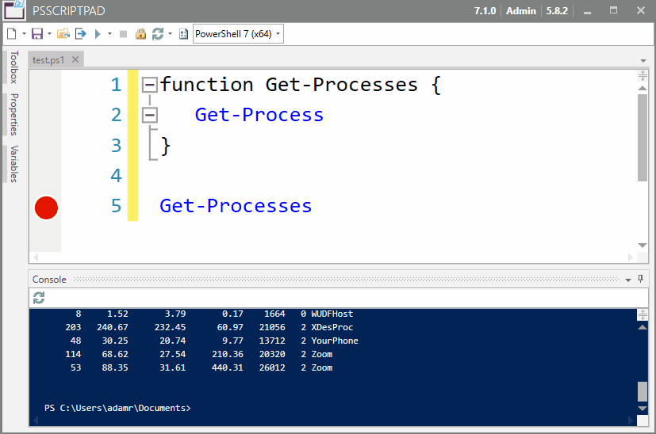
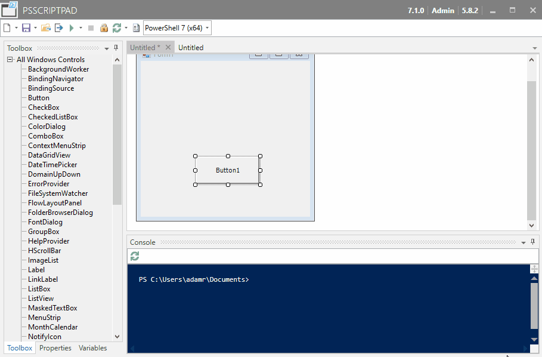
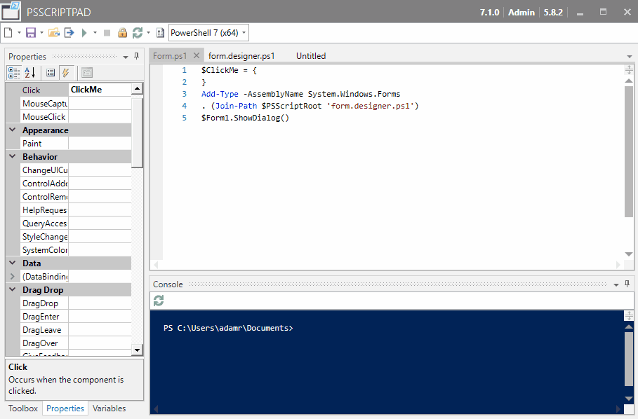

# PSScriptPad

PSScriptPad is the tiny editor for Windows PowerShell. It requires no installation or configuration. It weighs in around 4Mbs, can editor and execute PowerShell scripts, design Windows Forms and Package Executables. 

## Download

You can [download PSScriptPad from our website](https://ironmansoftware.com/downloads). It is just a .exe file. 

## Editing PowerShell

PSScriptPad supports editing PowerShell scripts. It supports syntax highlighting, syntax checking, IntelliSense and code folding. 

#### Creating a New PowerShell File

Click the New File button on the toolbar to create a new file. 

#### Opening a PowerShell Script

Click the Open File button on the toolbar to open a script. 

#### IntelliSense 

IntelliSense is automatically invoked. It will complete PowerShell cmdlet names, variables, paths, and parameter names. You can also press `Ctrl+Space` to manually invoke IntelliSense. As you type, the IntelliSense list will be filtered. Pressing tab will select and insert the current option. 

#### Code Folding 

Code Folding collapses blocks of PowerShell script that you wish to hide. You can collapse blocks such as if blocks, script blocks and functions blocks. Just click the minus and plus sign to close and open blocks. 

## Debugging 

PSScriptPad can also debug PowerShell scripts. It supports executing scripts, setting breakpoints, stepping through scripts and viewing the output of scripts in the terminal window. 

### Setting a breakpoint 

You can set breakpoints by clicking in the editor margin or by using the `F9` button to toggle a breakpoint on the selected line. 

### Running a Script

You can run a script by clicking the Run button or by pressing `F5`. It will run the currently open tab. 

### Stepping through a script

You can single step through a script using the following keys:

* `F10` - Step over
* `F11` - Step Into
* `Shift+F11` - Step Out

## Packaging Scripts

PSScriptPad can package scripts to executables using [package.psd1](packaging/package.psd1.md) files or by selecting a PS1 file and packaging with the default settings. 

### Packaging Without a Package.PSD1 file

You can select an PS1 file and click the package button and the script will be packaged into an executable. Results of the packaging process will be shown within the Console. 

### Packaging with a Package.PSD1 File

Package.psd1 files allow you to configure all the settings for the packaging process. You can create a package.psd1 file and then when you click the Package button, it will use that file for configuration.

## Windows Form Designer

The Windows Form Designer allows you to create forms with PowerShell scripts. 

### Creating a new Form

You can create a new form by click the drop arrow next to the new file button and click New Windows Form.

### Adding Controls to a Form

You can add controls to a form by expanding the toolbox pane, clicking the control you'd like to add and then clicking on the form.

### Setting Properties of Controls

You can set the properties of a control by selecting the control and then modifying properties in the Properties pane. 

### Setting Event Handlers

You can set event handlers for a control by selecting the control, clicking the lightening bolt icon in the Properties pane and then typing the name of the event handler for the event you'd like to hook up. After saving the form, you can view the code-behind file to define what happens when the event takes place. 

### Running a Form

You can run a form by open the PS1 file for your form and pressing `F5` or by clicking the run button. 

## Themes 

You can switch between dark and light themes using the options dialog. 

